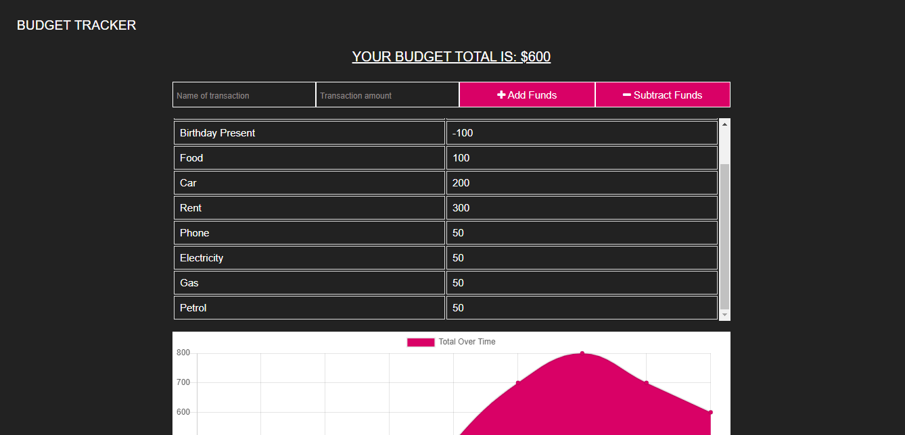

# Budget-Tracker

Using Progressive Web Application (PWA) this application enables the user to add expenses and deposits to their budget with or without an online connection. When entering transactions offline, data should populate the total when connected back online.

Launch the application via Heroku here <https://budgettracker-19ms.herokuapp.com/>

## User Story

- AS AN avid traveller
- I WANT to be able to track my withdrawals and deposits with or without a data/internet connection
- SO THAT my account balance is accurate when I am traveling

## Business Context

Giving users a fast and easy way to track their money is important, but allowing them to access that information anytime is even more important. Having offline functionality is paramount to our applications success.

## General Info

What is Progressive Web Application (PWA)?

A Progressive Web App (PWA) is a web app that uses modern web capabilities to deliver an app-like experience to users. These apps meet certain requirements (see below), are deployed to servers, accessible through URLs, and indexed by search engines.

What is required for PWA?
To be considered a Progressive Web App, your app must be:

- Progressive - Work for every user, regardless of browser choice, because they are built with progressiveenhancement as a core tenet.
- Responsive - Fit any form factor, desktop, mobile, tablet, or whatever is next.
- Connectivity independent - Enhanced with service workers to work offline or on low quality networks.
- App-like - Use the app-shell model to provide app-style navigation and interactions.
- Fresh - Always up-to-date thanks to the service worker update process.
- Safe - Served via HTTPS to prevent snooping and ensure content has not been tampered with.
- Discoverable - Are identifiable as “applications” thanks to W3C manifests and service worker registration
- Re-engageable - Make re-engagement easy through features like push notifications.
- Installable - Allow users to “keep” apps they find most useful on their home screen without the hassle of an appstore.
- Linkable - Easily share via URL and not require complex installation.
- Offline Support - Apps should be able to work offline. Whether that be displaying a proper "offline" message or caching app data for display purpose.

## Functionality:

- Enter deposits offline
- Enter expenses offline
- When brought back online:

Offline entries should be added to tracker.
In order to achieve offline support, a manifest file and a service worker file must be created.
<https://developer.mozilla.org/en-US/docs/Web/Manifest>

Purpose
The manifest file is a simple text file (JSON file) that lists the resources (app's displayed name, icons, aswell as splash screen) the browser should cache for offline access.

## Install

    - npm i install
    - npm i express
    - npm i mongoose
    - Run

    On your VS Code clone the gibthub repository.
    - Install all dependencies

    Create a terminal on the Budget-Tracker folder and run:
    - mongod

    Create another terminal on the same folder and run:
    - node server
    - Deploy
    - Follow the steps on how to deploy an app on Heroku
    - Create a repository of your project in github

    Clone that repository to your VS Code using git:
    - git clone "the link of the github repo"
    - In your project folder terminal create a heroku application using this command:
    - Heroku create "name of your project"
    - Log in to your Heroku account and look for your project in the Dashboard. Go to the tabs located on top and click on DEPLOY. - In the Deployment Method, click on the github icon to connect it to your github repository. Then on Automatic Deploy, click and enable automatic deploys
    - On the tabs on top, click Overview then on Installed add-ons click Configure Add-ons.
    - Make sure that you have "process.env.MONGODB_URI" in your mongoose.connect under the server file.
    - Try to add a code and push it to your github. It will automatically hook it to Heroku. Now view your Heroku app.

## Dependencies

- "dependencies":
- "express": "^4.17.1",
- "install": "^0.13.0",
- "mongodb": "^3.5.5",
- "mongoose": "^5.9.7",
- "nodemon": "^2.0.2"

## Technologies

- HTML5
- CSS
- jQuery
- Express
- MongoDB
- Mongoose
- IndexedDB
- Bootstrap

## Demo

The project should look like this:

## Author

Megan Skippen
github: https://github.com/mskippen
email: msmskippen@gmail.com

## Copyright

© 2021 Project Agents Pty Ltd. All Rights Reserved.